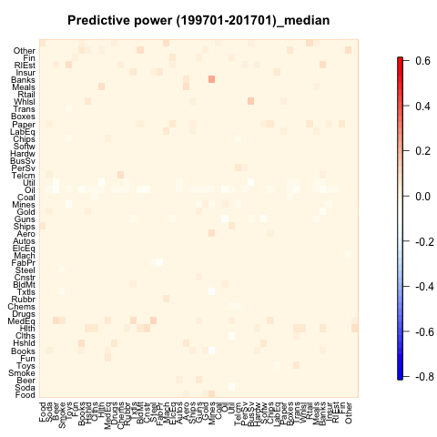
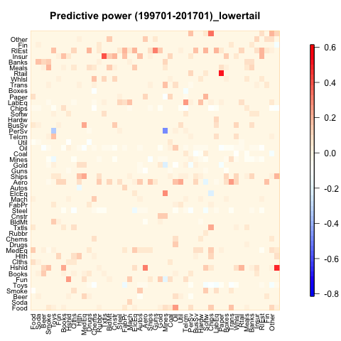
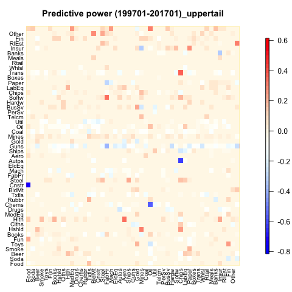

[](http://quantlet.de/)

## [](http://quantlet.de/) **INET-totaldire** [](http://quantlet.de/)

```yaml


Name of QuantLet: INET-totaldire

Published in: Industry Interdependency Dynamics in a Network Context

Description: 'Plot the image maps of the predictive power of 49 USA industries return data                        under different stress situations (median, lowertail and uppertail)'

Keywords: 'interdependency, network, direction, stress situation, predictive power, image plot'

Author: Ya Qian

Submitted: Ya Qian

Datafile: 'industryname.csv, beta_L_median.csv, beta_L_lowertail.csv,      beta_L_uppertail.csv'

Output: 'Plot the images of the predictive power of industry return data under different stress situations (median, lowertail and uppertail) and summary of the direction information of the coefficients under these situations' 

```







### R Code
```r

#Close windows and clear variables                                                                   
graphics.off()
rm(list = ls(all=TRUE))

# install and load packages
libraries = c("fields", "graphics")
lapply(libraries, function(x) if (!(x %in% installed.packages())) {
  install.packages(x)})
lapply(libraries, library, quietly = TRUE, character.only = TRUE)

#Read the datafile
datafile         = c("beta_L_median.csv", "beta_L_lowertail.csv","beta_L_uppertail.csv")
summ             = matrix(0,3,7)
rownames(summ)   = c("median", "lowertail", "uppertail")
colnames(summ)   = c( "No. of Coefficients", "No. of Nonzeros", "No. of Negatives", "No. of Positives", "Max", "Min", "Average")
for (s in 1:length(datafile)){
conn             = read.csv(datafile[s], header = TRUE, sep = ",", dec = ".")
industrynames    = read.csv("industrynames.csv")
rownames(conn)   = industrynames[ ,2]
colnames(conn)   = industrynames[ ,2]
conn             = conn[ ,-1]
data             = data.matrix(conn)
maxvalue         = max(data)
minvalue         = min(data)
summ[s,1]        = sum(data!=0) + sum(data==0)
summ[s,2]        = sum(data != 0)
summ[s,3]        = sum(data < 0)
summ[s,4]        = sum(data > 0)
summ[s,5]        = maxvalue
summ[s,6]        = minvalue
summ[s,7]        = mean(data)
  
titles           = c("Predictive power (199701-201701)_median",
                    "Predictive power (199701-201701)_lowertail",
                    "Predictive power (199701-201701)_uppertail")
data             = data.matrix(conn)

#plot the images and save them
savepath         = file.path("/Users/qianya/Library/Mobile Documents/com~apple~CloudDocs/ffdata/test/output", paste("totalimage_d", s, ".png", sep = "")) 
png(file = savepath)
par(mar=c(3,3,3,6))
image(data, axes = FALSE, main = titles[s])
colorTable       = designer.colors(50, c("blue","white" ,"red") )
mtext(colnames(data), side = 2, line=0.3, at = seq(0,1,1/48),  las = 2, cex = 0.8)
mtext(colnames(data), side = 1, line=0.3, at = seq(0,1,1/48),  las = 2, cex = 0.8)
image.plot(data, add = TRUE, col = colorTable, legend.cex = 0.1, legend.mar = 3.5, legend.width = 0.5, zlim = c(-0.80,0.60))
}
write.table(summ, file = "summaryimages.txt", sep = "&")
dev.off()
```

automatically created on 2018-05-28